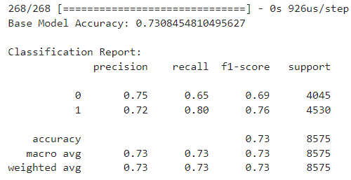
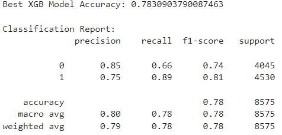
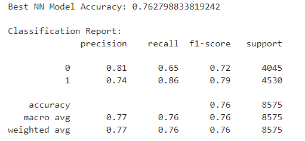

# Deep Learning Challenge

Building a Neural Network to Select Applicants for Funding With the Best Chance of Success in Their Ventures

## Overview

The nonprofit foundation Alphabet Soup wants a tool that can help it select the applicants for funding with the best chance of success in their ventures. From Alphabet Soup’s business team, a CSV containing more than 34,000 records from organizations they have funded was provided. This dataset contains a number of columns that capture metadata about each organization, such as: 

- **EIN** and **NAME**—Identification columns
- **APPLICATION_TYPE**—Alphabet Soup application type
- **AFFILIATION**—Affiliated sector of industry
- **CLASSIFICATION**—Government organization classification
- **USE_CASE**—Use case for funding
- **ORGANIZATION**—Organization type
- **STATUS**—Active status
- **INCOME_AMT**—Income classification
- **SPECIAL_CONSIDERATIONS**—Special considerations for application
- **ASK_AMT**—Funding amount requested
- **IS_SUCCESSFUL**—Was the money used effectively

Using this dataset, several nearal network based binary classifiers, that can predict whether applicants will be successful if funded, were trained and evaluated. The target accuracy of these models was 75% or better.

## Results

### Base Neural Nework Model

**Data Preprocessing**

- Dropped the **EIN** and **NAME**  variables from dataset
- Consolidated the number of **APPLICATION_TYPE** to 9 distinct values
- Consolidated the number of **CLASSIFICATION** to 6 distinct values
- One Hot Encoded the categorical variables
- Seperarate the target variable, **IS_SUCCESSFUL**, from the rest of the 43 independent variables.
- Used TrainTestSplit to split into train/test datasets
- Used StandardScaler to normilize the independent (X) train/test datasets

**Building the Model**

- Added the first hidden layer with 172 neurons (4 x number of input features) using the RELU activation function
- Added a Dropout layer which randomly drops 20% of the input neurons in an attempt to improve performance
- Added a second hidden layer of 43 neurons (same as input features) using the RELU activation function
- Added the output layer using a sigmoid activation function for classification
- Compiled using the binary_crossentropy loss function and ADAM optimizer since those perfom well for binary classification 

**Training and Evaluating the Model**

Model was trianed for 37 epochs, using a batch size of 64. Below is the classification report showing this model only achieved an accuracy score of 73%, which is below the required 75%.

### Optimized Neural Nework Model

**Data Preprocessing**

In addition to the steps used for the base model, the following was done based on EDA and training a XGB model to get variable importance and establish a performance baseline.

- Added a **NAME_COUNT** variable which tracks how often a name occurs in the dataset. As the saying goes "Success Breeds Success".
- Dropped the **STATUS** and **SPECIAL_CONSIDERATIONS** variables since their near uniform nature means they have little predictive value.
- Consolidated the number of **INCOME_AMT** to 2 distinct values
- Consolidated the number of **AFFILIATION** to 2 distinct values
- Consolidated the number of **USE_CASE** to 2 distinct values

The resulting dataset now contained only 27 (vs. 43) independent variables to make training more efficient.

**Building, Training, and Evaluating the Model**

Instead of hand tunning the model, the Keras Tuner was used to perform automatic hyperparemter optimization resulting in 254 different models being trained/evaluated. Whereas the best XGB model results in a 78.3% accuracy score, the best neural network model achieves an accuracy score of only 76.3%.

## Summary

With some feature engeering, a neural network model that achieves the desired 75% or better accuracy, was trained and evaluated.  However, a better peforming XGB model achieved an even higher accuracy score for a fraction of the training time. As such, it's recommended the XGB model be deployed, since it would take far less resources to re-train, and is more interpretable.
